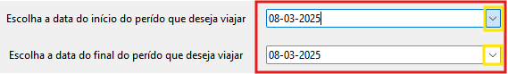
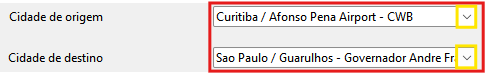

# Buscador de Passagens


## O que é?
Um sistema que busca passagens para um período, pega as que estiverem na faixa de preço informado e envia as informações dos voos encontrados para o email informado.

## Requisitos
- Para que o sistema funcione corretamente, é necessária a instalação de:
    - **Git**
        - Necessário para a clonagem do repositório
        - [Instalar Git](https://git-scm.com/)

    - **Python**
        - O sistema foi feito em python, portanto é necessário tê-lo para a execução do sistema
        - Baixe a versão mais atual
        - [Instalar Python](https://www.python.org/downloads/)

    - **ChromeDriver**
        - Verifique a versão do seu Google Chrome e baixe a versão do Chromedrive correspondente a ela;
        - Para verificar a versão do seu Chrome, vá em chrome://settings/help.
        - [Instalar ChromeDrivee](https://developer.chrome.com/docs/chromedriver/downloads?hl=pt-br)

    - **Google Chrome**
        - Por hora, o sistema foi feito para roda apenas no Chrome
        - [Instalar Google Chrome]((https://support.google.com/chrome/answer/95346?hl=pt-BR&co=GENIE.Platform%3DDesktop#zippy=%2Cwindows))


## Como funciona
### 1 - Informações necessárias:
- **Data de Início e Final**: O sistema permite buscar passagens para múltiplos dias. Para isso, o usuário deve informar a data de início, que marca o primeiro dia do período desejado, e a data final, que define o último dia. Com essas informações, o sistema pesquisa todas as passagens disponíveis dentro desse intervalo.

- **Origem**: é o aeroporto de origem, de onde o voo irá partir.

- **Destino**: é o aeroporto destino, onde o voo será finalizado.

- **Preço Máximo**: é o preço máximo que o usuário quer para a passagem. O sistema somente pegará os voos que forem mais baratos ou tiverem o mesmo preço.

- **E-mail**: o e-mail para onde será enviado a tabela com os voos encontrados

### 2 - Inicialização das Classes de Busca:
- Utilizando as informações inseridas pelo usuário, o sistema inicializa as classes de busca e executa a busca das passagens para cada uma delas.

### 3 - Criação da Tabela:
- Após obter as informações sobre os voos, elas são passadas para uma tabela. A tabela é única, portanto, contém informações consolidadas de todos os voos de todas as empresas aéreas.

- **Composição da tabela**
    - **Empresa**: é a empresa aérea do voo
    - **Partida**: data e horário de partida do voo;
    - **Chegada**: data e horário de chegada do voo;
    - **Conexões**: é o número de conexões que o voo possui;
    - **Preço**: preço da passagem no momento da busca
    - **Link**: é o link para acesssar o voo.

### 4 - Envio da Tabela:
Após a criação da tabela, a mesma é enviada para o e-mail que o usuário informou no início.

## Execução
### 1 - Clonagem
- Abra um terminal no diretório onde desejar armazenar o projeto e excute:
```bash
git clone https://github.com/PedroPVB26/BuscadorDePassagens.git
```

### 2 - Entrar no repositório 
- Ainda no mesmo terminal por onde foi feita a clonagem:
```bash
cd BuscadorDePassagens
```

### 3 - Executar o arquivo main
- Lembrando, para que o sistema funcione, você deve ter o **python** instalado na sua máquina;
- Para executar o sitema, execute, ainda no mesmo terminal, o seguinte comando:
```bash
python main.py
```

### 4 - Inserir os dados
**1 - Data de Início e Final**  

- As datas de início e fim definem o período do voo que deve ser procurado.
- **Observação**: A data de início deve ser igual ou posterior a data do dia atual e data final deve ser igual ou posterior a data de início.
- Você pode inserir a data de forma manual (utilizando a mesma formatação) ou escolher por meio do calendário, que pode ser acessado pressionando na extremidade direita do campo (indicada pela área contornada de amarelo na imagem).

**2 - Origem e Destino**  

- Origem define a cidade de onde o voo irá partir, e o destino o destino final do voo.
- **Observação**: não insira as cidades de forma manual, selecione por meio da lista das cidades disponíveis, pressionando a extremidade direita do campo (indicada pela área contornada de amarelo na imagem).

**3 - Preço Máximo**  

- O preço máximo desejado para o voo.
- **Observação**: Insira apenas números inteiros.

**4 - Buscar Voos**
- Após o preenchimentos das informações, o sistema faz uma pequena validação e, caso ela passe, o botão para buscar os voos será habilitado, caso contrário permancerá desabilitado até que todos os campos passem pela validação.

### 5 - Esperar finalização das buscas
- Após pressionar o botão para buscar os voos correspondentes, o sistema abrirá o navegaodr (Google Chrome) e iniciará as busca nas companhias aéreas Latam, Gol e Azul.
- **Observação**: enquanto o sistema estiver com o navegador aberto, não faça nenhuma ação nele, de preferência, mantenha o navegador **minimizado**.

### 6 - Verificar o e-mail
- Após a finalização da busca, o navegador fechará sozinho e será exibida uma janela informando que o resultado da busca foi enviado para o e-mail informado.
- Verifique o seu e-mail e obtenha a tabela enviada.
- **Observação**: pelo fato de o preço das passagens aéreas mudarem com certa frequência, nem sempre o valor de um voo informado na tabela será o mesmo quando o link para a compra do mesmo for acessado.

